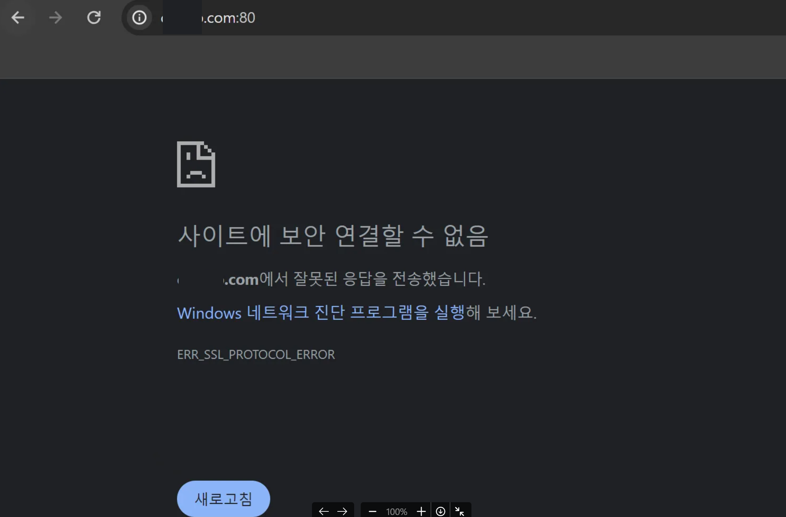
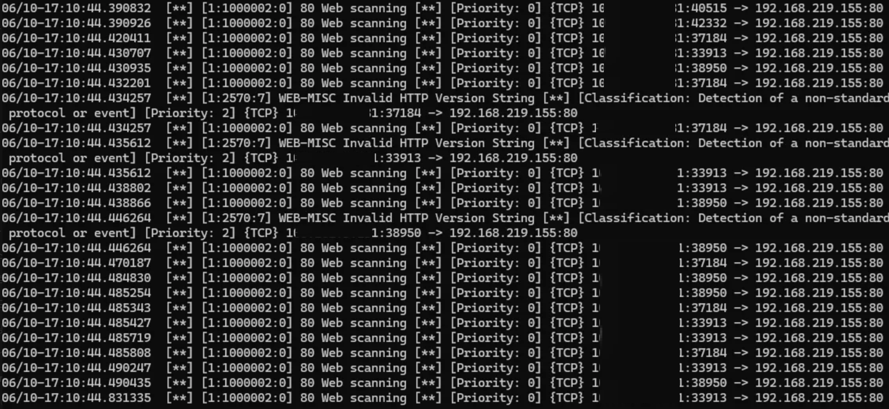

snort 실행

```
sudo snort -A console -q -u snort -g snort -c /etc/snort/snort.conf -i wlan0
```

rules 설정하는 경로

```
sudo vi /etc/snort/rules/local.rules
```

기본 룰은 아래와 같이 작성했다.

```
alert tcp any any -> $HOME_NET 443 (msg:"Web scanning"; content : "404"; http_stat_code; nocase; sid: 1000001; rev:1)
```

$HOME_NET 가 의미하는 IP 찾기

- sudo vi /etc/snort/snort.conf 에서
- var HOME_NET ~~~에 적혀있는 IP

---

서버(라즈베리)에 모니터를 연결하고 snort를 킨 상태로 외부에서 블로그 접속 시 네트워크가 끊겨버림.

ping은 보내지는데 snort에서 icmp는 감지안됨
: 전처리기를 설정 안해놔서 그런 것 같아 시도중

아래 오류는 전처리 설정 문제

- warning: no preprocessors configured for policy 0

---

서버 접근 로그 실시간
- tail -f /var/log/nginx/access.log

---

서버의 access.log 로그를 보니까 외부에서 들어오는 접속(GET)요청이 192.168.219.1(공유기)로 탐지됨


공유기(라우터)에서 포트포워딩되어 들어오기 때문에, 192.168.219.155(서버ip)에서는 라우터ip로 감지됨.

따라서 규칙을 설정할 때 출발지(src)ip를 219.1로 설정해야함.

근데 any로 설정하면 다 적용되어야 하는데? 왜 안되지

>>>ㅋㅋㅋㅋ 핫스팟 틀어만 놓고 노트북에 연결 안하고 같은 네트워크로 하고 있었음.

내용 취소!

---


잘 뜬다.

근데 의문점은 첫 접속시 안 뜨고 새로고침해야 그때부터 뜬다. (이건 나중에 알아보자.)

---

/etc/snort/rules/local.rules


---


감지 성공.



80포트로 접속하면 페이지는 뜨지 않지만(이건 80포트로 직접 입력시 443으로 리다이렉트해놓지 않아서) 로그는 80 Web scanning이라고 잘 뜸.


---

- etc/snort/rules/local.rules 추가 규칙

alert tcp any any -> $HOME_NET 80 (msg:"80 Web scanning"; sid: 1000002;)
alert tcp any any -> $HOME_NET 443 (msg:"Web scanning"; sid: 1000001; rev:1)

snort -A console -c /etc/snort/snort.conf -i wlan0 

snort snort -c /etc/snort.conf -i wlan0

으로 실행을 하면, 네트워크 트래픽을 모니터링하고 규칙에 따라 경고(alert)를 생성한다.

그러나 이 명령은 IDS 모드(침입 탐지 시스템)로 실행하는 것이고, 트래픽을 차단하지는 않는다.

규칙에 ‘alert’,’log’,’pass’ 등의 동작을 지정할 수 있지만, 트래픽을 차단하는 ‘drop’ 규칙을 사용하려면 snort를 IPS 모드(침입 방지 시스템)로 실행해야 한다. IPS 모드에서는 snort가 인라인모드로 동작하여 패킷을 실시간으로 차단할 수 있다.

---

snort에서 사용가능한 daq는 두 가지가 있다.

- **nfq**:
    - **통합**: Netfilter와 iptables를 사용하여 세밀한 트래픽 제어 가능.
    - **성능**: 사용자 공간으로의 패킷 전송으로 인해 성능 저하 가능.
    - **설정**: 추가적인 iptables 설정 필요.
- **afpacket**:
    - **통합**: 직접 네트워크 인터페이스에서 패킷 수집.
    - **성능**: 높은 성능 제공.
    - **설정**: 간단한 설정, 추가적인 iptables 설정 불필요.

나는 afpacket을 사용했다.

---

daq 설정법

/etc/snort/snort.conf 에서 아래 부분 수정


**참고**

1. snort.conf 설정 파일 수정
- DAQ 모듈을 afpacket으로 설정
config daq: afpacket
- DAQ 모듈 디렉토리를 설정 (일반적으로 자동으로 설정되므로 생략 가능)
config daq_dir: /usr/local/lib/daq
- 인라인 모드로 설정
config daq_mode: inline
- afpacket 관련 변수 설정 (필요에 따라 설정)
config daq_var: buffer_size_mb=1024
- 인터페이스 설정 (snort 명령어에 직접 지정할 수도 있음)
config interface: eth0
1. snort.conf 파일 DAQ 설정 부분 예제
- Configure DAQ related options for inline operation. For more information, see README.daq
- Use the afpacket DAQ module in inline mode
config daq: afpacket
config daq_mode: inline
- Optionally set DAQ variables
config daq_var: buffer_size_mb=1024

daq 설정 된 snort 실행 명령어

sudo snort -Q --daq afpacket -c /etc/snort/snort.conf -i eth0

---


threshold 옵션은 더 이상 사용되지 않는다고 한다.

대신 detection_filter를 사용하자.

detection_filter:track by_src, count 30, seconds 60;

 Invalid interface specification: 'wlan0'!


sudo apt-get install libnetfilter-queue-dev

---

무선 랜(wlan) 환경에서 인라인모드가 힘들다는 것 같아서 변경.


다시 취소.

---

---

리눅스에서 무선랜을 이용해 패킷을 캡쳐하기 위해선 사용하는 무선 인터페이스가 모니터 모드로 설정되어 있어야 함.

-AP에 접속해 인터넷을 이용할 경우 : managed

-패킷 캡처 혹은 해킹 등 : monitor

iwconfig 명령어를 통해 초기 무선 인터페이스의 설정을 확인.


Managed 모드로 되어있는 것을 확인할 수 있다.


Access Point라는 항목이 존재함으로써 wlan0 인터페이스가 AP에 접속이 가능한 상태임을 짐작할 수 있다.

Monitor 모드로 변경

```
iw dev wlan0 set type monitor
```

---

….ㅎㅎ

ips는 유선랜 환경에서 해보도록 하자.